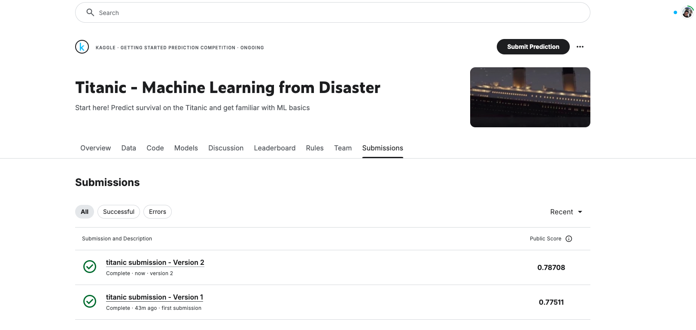

# 🚢 Titanic - Machine Learning from Disaster

**📚 Pós-graduação em Desenvolvimento de Aplicações Inteligentes**  
**🎯 Disciplina:** Inteligência Artificial e Aprendizado de Máquina  
**🗂️ Atividade 02:** Titanic Dataset - Kaggle Challenge  
**👨‍🎓 Professor:** Prof. Dr. Francisco de Assis Boldt

---

## 👤 Informações do Aluno

- **🔛 Nome:** Otávio Lube dos Santos
- **🎓 Matrícula:** 20231DEVAI0157

---

## 🗋 Descrição da Atividade

A **segunda atividade prática** da disciplina consiste em desenvolver um **modelo completo de aprendizado de máquina** para o famoso **Titanic Dataset** da competição [Titanic - Machine Learning from Disaster](https://www.kaggle.com/c/titanic).

Os passos incluem:

1. 💾 Carregar e explorar os dados fornecidos pela competição.
2. 💠 Limpeza e pré-processamento dos dados.
3. 🚀 Treinamento de um modelo preditivo para prever a sobrevivência dos passageiros.
4. 📄 Fazer pelo menos uma submissão no Kaggle e incluir um **print screen das submissões** no notebook.

---

## 🎯 Objetivos

1. Implementar um pipeline completo de aprendizado de máquina.
2. Explorar e entender o dataset Titanic.
3. Aplicar técnicas de pré-processamento:
   - Tratamento de valores ausentes.
   - Engenharia de features.
   - Codificação de variáveis categóricas.
4. Treinar e avaliar modelos de classificação binária.
5. Submeter as previsões ao Kaggle.

---

## 💾 Dataset Utilizado

- Arquivos fornecidos pelo Kaggle:
  - [`train.csv`](https://www.kaggle.com/c/titanic/data): Dados de treino com o rótulo `Survived`.
  - [`test.csv`](https://www.kaggle.com/c/titanic/data): Dados de teste sem o rótulo `Survived`.

---

## ⚙️ Pipeline do Modelo

### 1. **Exploração dos Dados**

Carregar e explorar os dados utilizando pandas:

```python
import pandas as pd
train = pd.read_csv("train.csv")
test = pd.read_csv("test.csv")
print(train.head())
```

Observar as estatísticas descritivas e identificar valores ausentes:

```python
print(train.describe())
print(train.isnull().sum())
```

---

### 2. **Pré-processamento**

Tratar valores ausentes e codificar variáveis categóricas:

```python
# Preencher valores ausentes
train['Age'].fillna(train['Age'].median(), inplace=True)
train['Embarked'].fillna(train['Embarked'].mode()[0], inplace=True)

# Codificar variáveis categóricas
train['Sex'] = train['Sex'].map({'male': 0, 'female': 1})
train['Embarked'] = train['Embarked'].map({'C': 0, 'Q': 1, 'S': 2})
```

Criar novas features para melhorar o modelo:

```python
# Criar novas features
train['FamilySize'] = train['SibSp'] + train['Parch'] + 1
train['IsAlone'] = (train['FamilySize'] == 1).astype(int)
```

---

### 3. **Treinamento do Modelo**

Dividir os dados em treino e validação:

```python
from sklearn.model_selection import train_test_split

X = train.drop(columns=["Survived", "Name", "Ticket", "Cabin", "PassengerId"])
y = train["Survived"]

X_train, X_val, y_train, y_val = train_test_split(X, y, test_size=0.2, random_state=42)
```

Treinar o modelo usando Random Forest:

```python
from sklearn.ensemble import RandomForestClassifier
from sklearn.metrics import accuracy_score

model = RandomForestClassifier(random_state=42)
model.fit(X_train, y_train)

predictions = model.predict(X_val)
print(f"Acurácia: {accuracy_score(y_val, predictions)}")
```

---

### 4. **Submissão no Kaggle**

Gerar previsões para o conjunto de teste e criar o arquivo `submission.csv`:

```python
test_predictions = model.predict(test.drop(columns=["Name", "Ticket", "Cabin", "PassengerId"]))

submission = pd.DataFrame({
    "PassengerId": test["PassengerId"],
    "Survived": test_predictions
})

submission.to_csv("submission.csv", index=False)
```

Submeter o arquivo `submission.csv` no Kaggle e capturar um **print screen da submissão**.

---

## 🎨 Resultados

### Acurácia no Kaggle

Após realizar a submissão, o resultado foi:

```
Score: 0.78708
```

### Print Screen da Submissão


